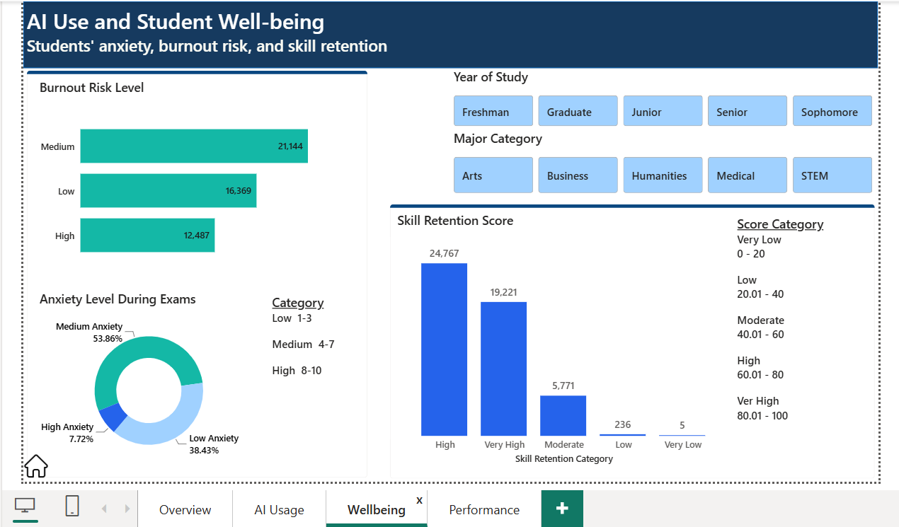

# AI & Academic Performance Analysis

## Project Overview

This project explores the relationship between students’ AI usage, study behaviour, well-being, and academic performance.

The dashboard was developed in Power BI to identify patterns in how students use AI and how these patterns relate to GPA changes, study hours, AI dependency, and anxiety levels.

## Project Objective

The goal of this project was to use data visualisation and analysis to explore how AI usage and learning behaviour relate to students’ academic performance and well-being, while presenting the findings in a clear and interactive dashboard.

## Tools Used

- Power BI
- Power Query
- DAX

## Data Preparation

The dataset was cleaned and transformed before analysis to improve consistency and support meaningful categorisation and visualisation.

Key transformations included categorising AI usage levels, AI dependency, subscription status, and other analytical fields used throughout the dashboard.

## Analysis

The dashboard explores:

- AI usage patterns
- AI subscription status
- Student learning behavior
- AI use cases
- Anxiety and burnout during exams
- Study habits
- GPA and academic performance
- Relationships between AI usage and academic outcomes

## Dashboard

The dashboard was designed across multiple pages to provide an overview of AI usage, student well-being, and academic performance.

### 1. Overview

### 2. AI Usage

### 3. Well-being

### 4. Academic Performance

## Key Insights

The analysis revealed several patterns in the data.

### Moderate AI Usage Showed the Strongest GPA Improvement

Students with moderate AI usage recorded the highest average GPA improvement compared with students with low or high AI usage.

This suggests that using AI more frequently does not necessarily lead to better academic outcomes. A more balanced level of use was associated with stronger GPA improvement in this dataset.

### Higher AI Dependency Was Associated with Higher Anxiety

Students with higher levels of AI dependency reported higher anxiety levels.

This indicates that the way students rely on AI may be important, rather than simply looking at how often they use it. Greater dependence may be associated with increased pressure or anxiety around academic work.

### Study Hours Were Positively Related to GPA Improvement

Students who spent more hours studying per week generally recorded greater GPA improvement.

The pattern suggests that consistent study habits remain an important part of academic performance, even when students make use of AI tools.

### AI Usage and Dependency Were Linked to Anxiety

Anxiety increased across higher levels of AI usage and dependency.

This was particularly noticeable among students with higher AI dependency, suggesting that increased reliance on AI may be accompanied by well-being concerns.

### AI Usage Varied Across Year Levels

Third-year students recorded the highest level of AI usage among the year groups analysed.

The analysis also showed that anxiety tended to be higher among students in the upper year levels, providing an area for further investigation into how academic demands and AI use may interact.

## Recommendations

* Encourage balanced AI usage to support academic performance and student well-being
* Promote responsible AI use as a learning tool rather than a replacement for critical thinking
* Provide well-being and stress-management support for highly dependent students
* Encourage consistent study habits alongside effective AI use
* Identify students experiencing high AI dependency and anxiety for early support
  
## Project Files

- `ai_academic_dashboard.png` — Dashboard preview
- `ai_academic_dashboard.png` — Dashboard preview

